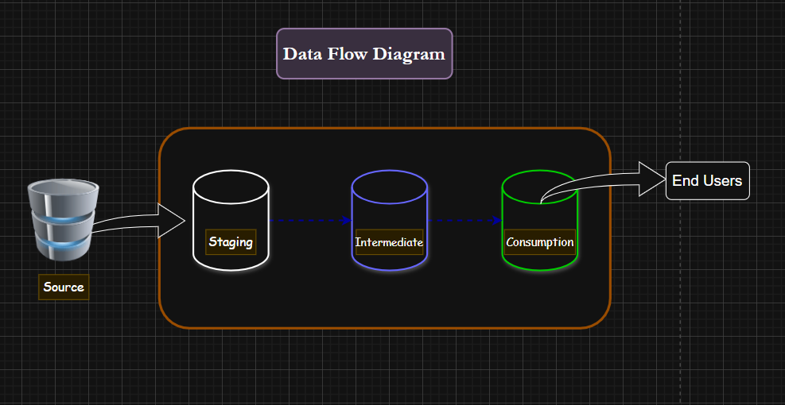
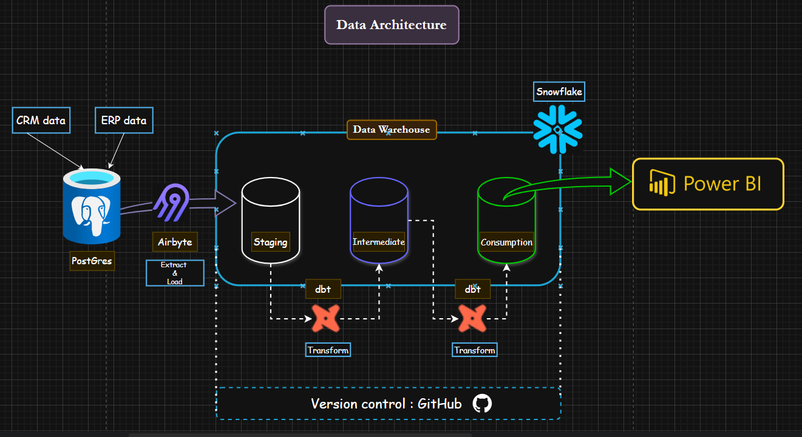
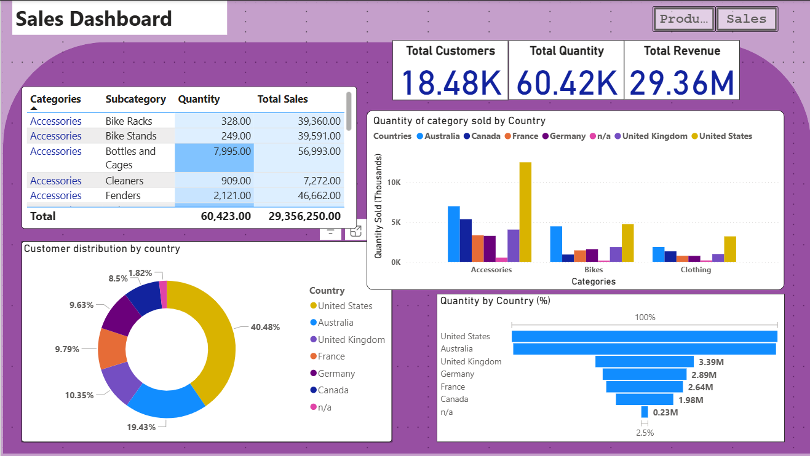
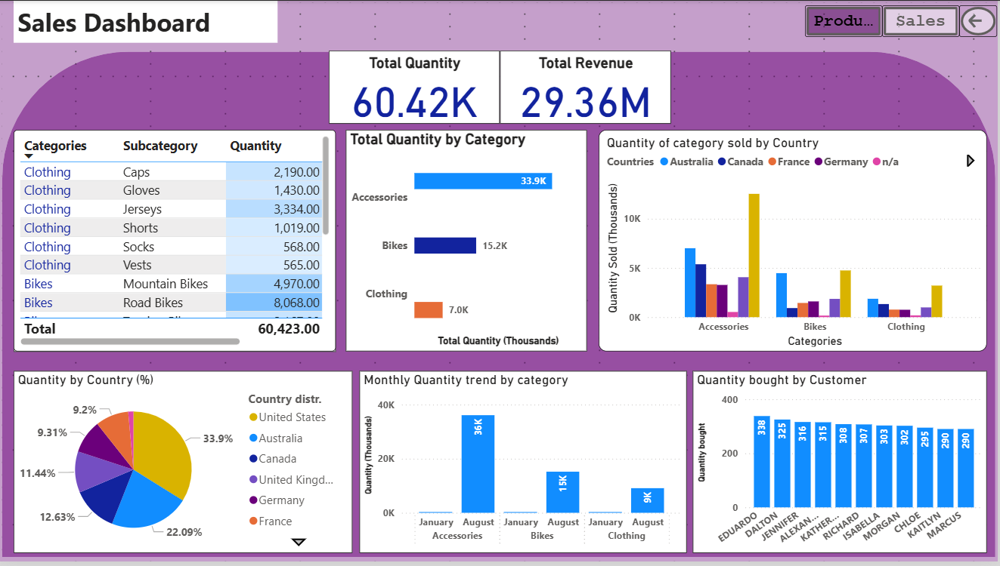
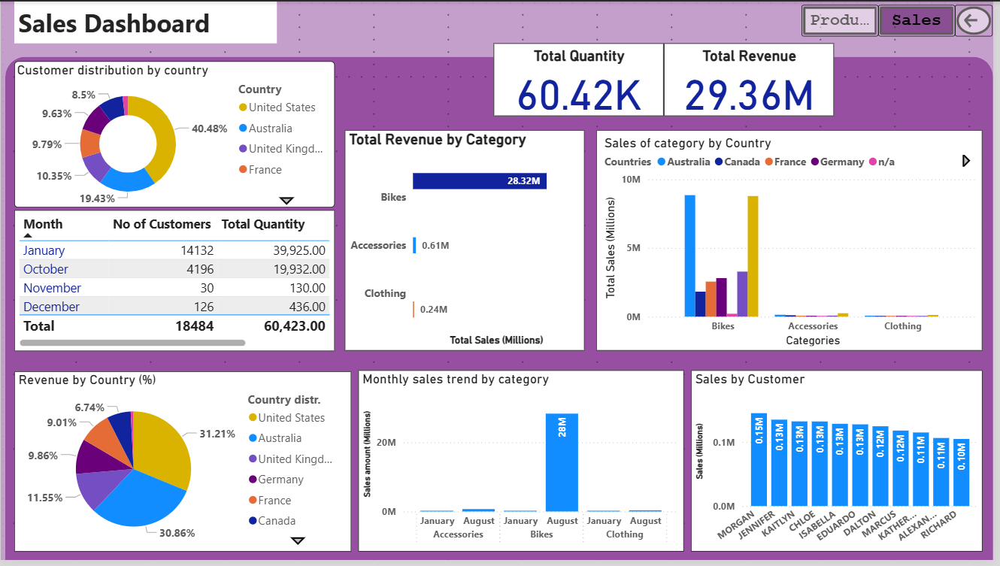

# Analytics Engineer Project 
(Recreated with Snowflake, dbt, and Power BI)

This is an end-to-end **data engineering project** that follows the modern **ELT** model.

I recreated BARAA's data engineering project using **Snowflake**, **dbt (Data Build Tool)**, **Power BI** , **Git & GitHub**
---

## Project Architecture
 
 

In this project, I extracted and loaded the raw data into Snowflake then transformed using dbt models (staging → silver → gold layers)

---

## Project Flow

1. **Data Ingestion:** Loaded raw data into Snowflake via dbt sources

2. **Modeling with dbt:** loaded the staging models with the yaml source file pointing at the raw snowflake wh; created intermediate (silver) models which contained cleaned data and the final gold models used for further reporting. 
 - Applied custom tests in dbt (e.g., uniqueness, not-null) ; Added filters (`WHERE` clauses) to reduce scan costs

3. **Visualization with Power BI:** Built an interactive dashboard to answer analytical questions

---

## Power BI Dashboard

() ()

---

## Learnings

- How to use dbt for transformation and running tests smartly to optimize cost 
- Visual interactive dashboard creation using Power BI
- Learning markdowns

## Credits

Thanks to my mentors Ahmed O.  for insights shared throughout the project.

